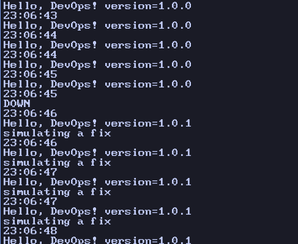
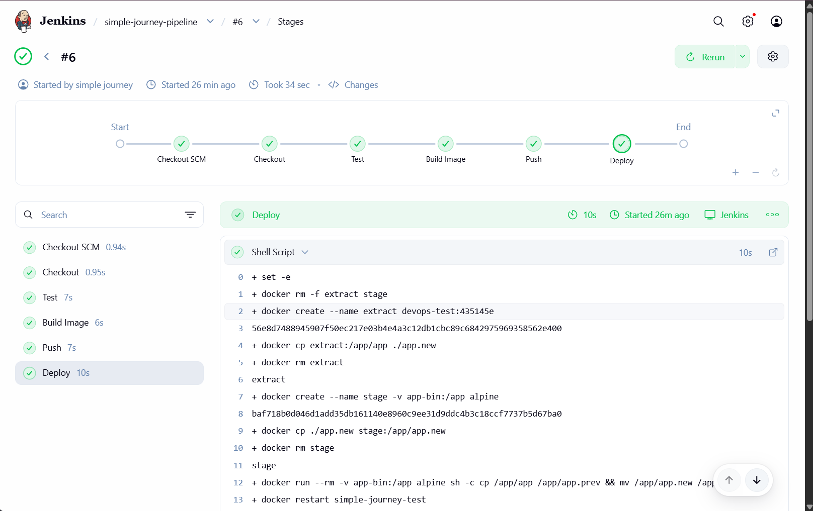
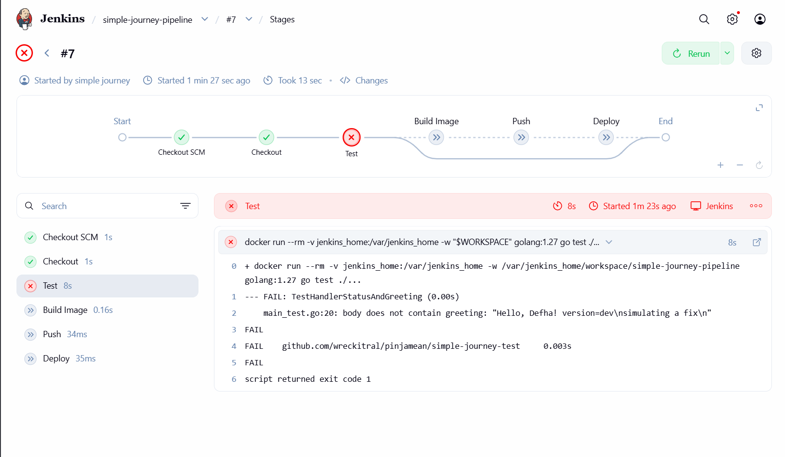

# Simple Journey Test

answer to technical test by simple journey

**Tool Version**
- Go: go1.27.1 linux/amd64
- Docker: 29.4.1, build 055a478 (Docker Desktop)

## Part I: Build

- create a multi-stage Dockerfile, the build stage produce a statically linked binary (`CGO_ENABLED=0`),
and for the final stage i use `scratch` for the smallest image size
- the app version is injectable at build time with `-ldflags`, so `GET /` shows the build version
- the image runs without Go installed on the host

**Build command**

```bash
docker build --build-arg VERSION=1.0.0 -t devops-test:1.0.0 .
```

**Why scratch**
- the binary is static, so it doesn't need any shared library, shell, or package manager
- distroless is a bit bigger (CA certs, tzdata, non-root user) and alpine is a few MB bigger with a shell, this app doesn't need any of that
- downside: no shell, so i can't `docker exec` into the container

**Why ENTRYPOINT instead of CMD**
- we are running a small single-purpose app, so i want the binary fixed as the container's executable
- with `CMD`, anything after the image name in `docker run` replaces the command, with `ENTRYPOINT` it is passed to the app as arguments

**Image size**

```
devops-test:1.0.0   8.37MB (2.51MB compressed content)
```

- `scratch` adds 0 bytes, so the image is only the stripped (`-s -w`) static binary
- most of the size is the Go runtime and `net/http`
- measured on amd64

## Part II: Deploy

**Run**

```bash
docker run -d --name simple-journey-test --restart unless-stopped -p 8080:8080 devops-test:1.0.0
```

- use restart policy of `unless-stopped` because if a crash happen then docker will automatically spin up the container again
- i pick it over `always` because `always` also brings back a container that i stopped on purpose once the docker daemon restarts

**Proof that the restart policy works**

- `docker kill` doesn't count as a crash, docker treats it as a manual stop and the container stays down
- i'm on Docker Desktop, the daemon runs inside a VM so i can't see the container PID from my shell, `sudo kill` fails
- so i kill the process from a privileged helper container that shares the VM's PID space

```bash
docker inspect -f '{{.State.Pid}}' simple-journey-test
docker run --rm --pid=host --privileged alpine kill -9 <pid>
sleep 2
docker inspect -f '{{.RestartCount}} {{.State.Pid}}' simple-journey-test
```

- restart count went from 0 to 1 and the PID changed, so docker restarted the container by itself

**swap hotfix scenario**

i choose the bind mount approach, so the binary lives on the host in `./bin`, then the container runs it from there.

**setup**

these command will pull the current v1.0.0 binary out of the running container
`mkdir -p bin`
`docker cp simple-journey-test:/app/app ./bin/app`

then recreate the container once, with the host folder mounted over /app
`docker rm -f simple-journey-test`
`docker run -d --name simple-journey-test --restart unless-stopped -p 8080:8080 -v "$(pwd)/bin:/app" devops-test:1.0.0`
- i mount the whole dir, because a single file mount can keep pointing at the old file after it is replcaed
- the mount hides the image's own `/app/app`, so `bin/` must already contain a working binary or the container could crash loops
- `bin/` is in `.gitignore`, since binary is not commited

**before swap**

`curl localhost:8080`
`Hello, DevOps! version=1.0.0`

**hotfix**

build the binary
`CGO_ENABLED=0 GOOS=linux GOARCH=amd64 go build -ldflags "-X main.version=1.0.1 -s -w" -o bin/app.new .`
check if its static binary or not
`ldd bin/app.new`
then we swap and restart
`cp bin/app bin/app.1.0.0`
`mv bin/app.new bin/app`
`docker restart simple-journey-test`

**watcher**

so while the swapping scenario was running i open another terminal that watches the up time for the container
`while true; do date +%T; curl -s -m 1 localhost:8080 || echo DOWN; sleep 0.5; done`



**Why i choose this approach**

- the binary lives on the host, so the fix survives if the container is recreated,
with `docker cp` the fix would be lost
- the swap i did is only replacing one file then running `docker restart`, no rebuild
- i use `mv` instead of `cp` so the replace is one atomic rename and `bin/app` is never half written
- i kept the old binary as `bin/app.1.0.0`, so rollbak is `mv` it back then restart
- trade off: the running system is only defined by a loose file on the host and not by an image,
so honestly i wont use this approach in production hehe, in production i would probably do rebuild and roll out a new image instead

## Part III: Jenkins
i got 5 stages of pipeline, checkout, test, build image, push, deploy

**setup**
- i run jenkins in the docker on port 8081
- docker socket is mounted into the jenkins container and the docker client is installed inside it,
so the pipeline can run docker command on my laptop
- tbh, running Jenkins as root with the docker socket is a shortcut for this test, in production i would use a separate agent

```bash
docker run -d --name jenkins -u root -p 8081:8080 -p 50000:50000 -v jenkins_home:/var/jenkins_home -v /var/run/docker.sock:/var/run/docker.sock jenkins/jenkins:lts-jdk17
docker exec -u root jenkins sh -c "apt-get update && apt-get install -y docker.io"
```

- the repo is private, Jenkins clones it with a read-only token
- the job is "Pipeline script from SCM", it reads the Jenkinsfile from the `main` branch
- i trigger the build manually with Build Now

**Credentials**
- no secret is written in the Jenkinsfile, only the credential IDs
- `github-token`: fine-grained token, contents read-only, to clone the private repo
- `ghcr-token`: classic token with `write:packages`, to push the image
- the push stage uses `withCredentials`, Jenkins injects the values only inside that block and masks them in the log
- the login uses `--password-stdin` so the token is not on the command line

**Stages**
- **Checkout**: `checkout scm` pulls the code from the repo
- **Test**: runs `go test ./...` inside a throwaway `golang:1.27` container, because Jenkins has no Go installed
- **Build Image**: `docker build --build-arg VERSION=<short commit hash>`, and the image is tagged with the same hash, so the running version always maps back to a commit
- **Push**: tag and push to GHCR as `ghcr.io/wreckitral/devops-test:<hash>`
- **Deploy**: the same "replace binary without rebuild" from Part II, automated:
  - take the new binary out of the image that was just built (`docker create` + `docker cp`)
  - put it in the `app-bin` volume
  - keep the old binary as `app.prev`, `mv` the new one in, `docker restart`
  - health check, then rollback if it fails

**Change from Part II**
- the bind mount to `./bin` does not work from the pipeline, because Jenkins runs in its own container and can't see my laptop folder
- so the container now uses a named volume instead, the idea is the same (binary lives outside the image, swap = replace file + restart)

```bash
docker volume create app-bin
docker run -d --name simple-journey-test --restart unless-stopped -p 8080:8080 -v app-bin:/app devops-test:1.0.0
```

**Evidence**
- successful run, all stages green, deployed `version=435145e`, the log ends with `deploy ok` and `Finished: SUCCESS`



- failing test: i broke a test on purpose, the Test stage went red and Build Image, Push and Deploy did not run, then i reverted it



**Rollback if deploy fails midway**
- before the swap the old binary is saved as `app.prev` in the volume
- after the restart the pipeline curls the app (from a small container that joins the app's network) and checks that it answers with the new version
- if the check fails, the stage copies `app.prev` back, restarts the container and exits with an error, so the build goes red
- limit, it only catches failures that show up in the health check, if the deploy dies in the middle of the swap itself it is not covered
- in production i would rollback by redeploying the previous image tag from the registry
